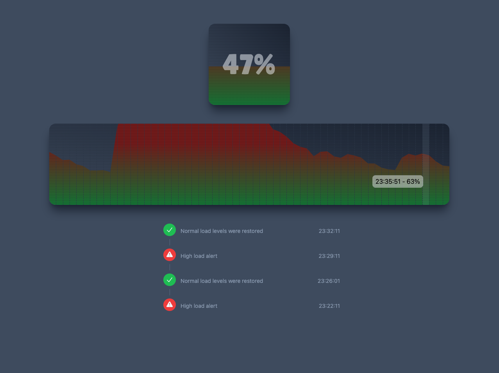

# Load Monitoring WebApp

Proof-of-concept (POC) for a browser-based CPU load monitoring application.

### Run

```
npm install && npm run start
```

Access the project at: [http://localhost:5173/](http://localhost:5173/)

## Tests

```
npm run test
```



---
